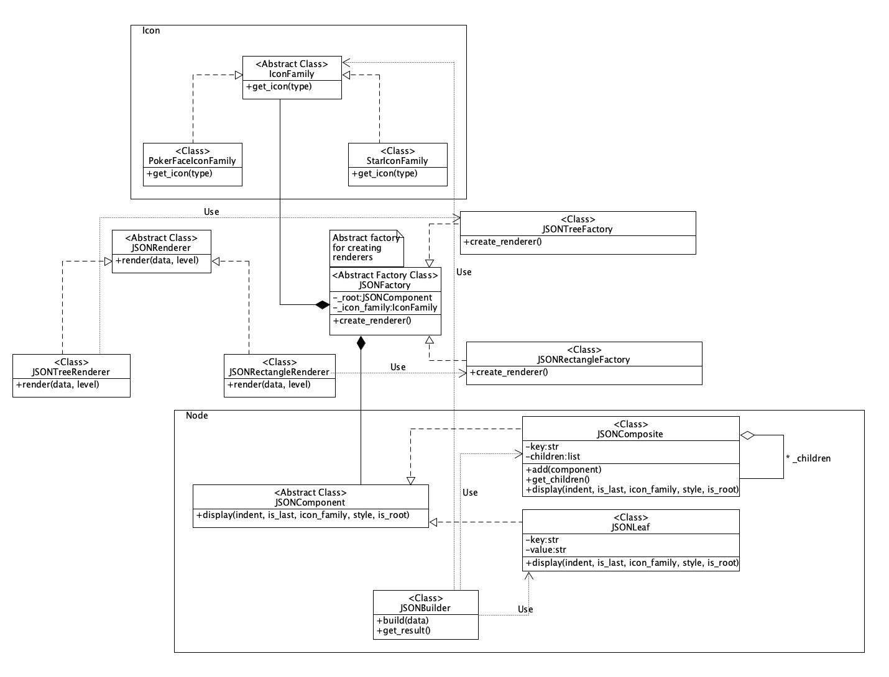

# Design Pattern设计文档

##### 姓名：童书未		学号：21307253

[TOC]

------

### 1. 设计模式概述

为了实现 Funny JSON Explorer 的功能并确保其可扩展性和可维护性，我们使用了以下设计模式：
- **工厂方法模式（Factory Method）**：用于创建不同风格的渲染器实例以及用于创建具体的渲染器实例，封装了实例化逻辑，使得创建过程更加灵活；并且使得添加新风格的渲染器变得简单，如果需要增加新的风格只需添加新的工厂类即可。
- **抽象工厂模式（Abstract Factory）**：用于创建相关对象的家族（不同风格的渲染器），通过增加新的具体工厂，系统可以轻松地扩展以支持新的风格或图标族。
- **组合模式（Composite Pattern）**：用于表示 JSON 结构，使得树形结构和叶节点可以被一致地处理。通过 `JSONComposite` 和 `JSONLeaf`，可以递归地构建和显示 JSON 数据结构。
- **建造者模式（Builder Pattern）**：通过不同的构建步骤创建复杂对象（例如，带有不同图标族和风格的 JSON 渲染器），可以使得创建复杂对象的过程更加清晰和分步骤进行。

------

### 2. 类图

### 3. 类和接口说明

##### （1）node: 定义了项目使用的可视化数据结构

JSONComponent：抽象基类，定义组合对象和叶对象的共同接口。

JSONComposite：组合对象，代表有子节点的 JSON 对象，可以包含叶节点或其他组合对象。

JSONLeaf：叶对象代表没有子节点的 JSON 对象（键值对）。

##### （2）Renderer：将 JSON 数据结构以特定格式呈现（或渲染）出来的组件

JSONRenderer：抽象基类，定义不同风格渲染器的共同接口。

JSONTreeRenderer 和 JSONRectangleRenderer：具体渲染器，实现 JSON 的树形和矩形渲染。

JSONFactory：抽象工厂，定义创建不同风格渲染器的接口。

JSONTreeFactory 和 JSONRectangleFactory：工厂，实现创建树形和矩形渲染器的实例。

##### （3）Icon：存储处理 icon 相关的数据

IconFamily：抽象工厂，定义创建不同图标族的接口。

PokerFaceIconFamily 和 StarIconFamily：具体工厂，实现创建具体图标族。

##### （4）main: 读取命令行参数，获得 StyledJSON并且调用渲染